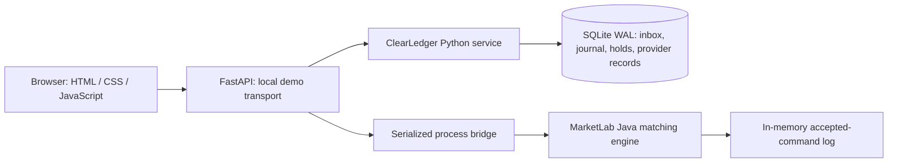

# Fintech Engineering Lab

Two runnable portfolio projects about financial correctness and market execution.
Built for Dat Nguyen's software engineering portfolio, drawing on his streaming,
replay, distributed-systems, and full-stack experience.

| Project | What it demonstrates | Demo |
| --- | --- | --- |
| **ClearLedger** | Balanced journal, durable event inbox, idempotency, reservations, refunds, and provider reconciliation | [Open public demo](https://fintech-engineering-lab.vercel.app/clearledger) |
| **MarketLab** | Java price/time matching, execution costs, buying-power reservations, synthetic feed recovery, and deterministic replay | [Open public demo](https://fintech-engineering-lab.vercel.app/marketlab) |

These are **synthetic prototypes with public demos and a local mode**. No login,
accounts at financial institutions, API keys, payment credentials, or real funds
are needed to try the public demos.

Source: [Da0t/fintech-engineering-lab](https://github.com/Da0t/fintech-engineering-lab).
The public deployment uses [isolated visitor sandboxes](docs/public-deployment.md)
with the actual Python and Java engines. The original local mode remains available.

## Run

Requires Python 3.11+ and a JDK 17+ (`java` and `javac` on PATH).

```bash
python3 -m venv .venv
source .venv/bin/activate
python -m pip install -r requirements.txt
python -m uvicorn app:app --host 127.0.0.1 --port 8765
```

Open [ClearLedger](http://127.0.0.1:8765/clearledger) or
[MarketLab](http://127.0.0.1:8765/marketlab).
Interactive API documentation is at [localhost:8765/docs](http://127.0.0.1:8765/docs).
The Java engine compiles on its first request. No Java libraries, Node build, or
external data services are required.

The preview created during development uses the already installed Python packages.
For reproducible installation elsewhere, create the virtual environment above.

## Try the two-minute demos

### ClearLedger: interrupt, retry, reconcile

1. Start with $2,900 available and $450 reserved from two synthetic deposits.
2. Click **Run failure scenario**. A simulated provider records a $129 payment;
   three identical event deliveries produce one pending inbox event. The worker
   is deliberately interrupted before posting the money.
3. Inspect the reconciliation break and audit trail. The wallet has not changed.
4. Click **Retry event** in the recovery inbox. The ledger and inbox commit together;
   the wallet is credited once and the break disappears.
5. Issue a $25 partial refund against that payment. The original deposit remains
   intact, with a separate reversing transfer.
6. Click **Simulate provider acknowledgment** on the refund reconciliation row.
   The independent provider record now agrees with the internal refund.

### MarketLab: the quoted price is not the execution price

1. In **Liquid** mode, submit a 50-share market buy. Inspect its fills and fee breakdown.
2. Switch to **Thin** mode (this resets the paper session). Submit the same order.
   It sweeps multiple levels, executes at different prices, and can leave an unfilled
   remainder that is cancelled.
3. Submit a buy limit below the market. Its reserved amount reduces available buying power.
   Cancel it and observe the reservation released.
4. Disconnect the synthetic feed, advance ten ticks, and reconnect. Stale-feed order
   entry is blocked; reconnect uses the current full snapshot.
5. Click **Verify replay**. A new engine reprocesses all accepted commands and compares
   the entire resulting state with the original, including fills and balances.

## Verify and measure

```bash
python -m pytest -q
python scripts/benchmark.py
```

The benchmark writes `artifacts/benchmark.json`, including host/runtime details,
workloads, measurement boundaries, invariant results, and a liquidity comparison.
It uses a temporary ledger and separate Java process; it does not alter the demo.
Performance results are observations of this workload on one machine, not production
capacity claims. The small Java timer is not a substitute for JMH.

An optional real-browser workflow check is in `scripts/browser_check.py`. It requires
the separate development dependency `playwright` and its Chromium browser:

```bash
python -m pip install playwright
python -m playwright install chromium
python scripts/browser_check.py
```

That script starts an isolated temporary demo server, exercises both projects, and
checks desktop/mobile layouts. Its generated screenshots are intentionally ignored
by Git.

## Architecture



The two domains do not share balances or transaction state. The common launcher and
small dependency-free frontend make them easy to run together. See the project
READMEs for design decisions and boundaries:

- [ClearLedger](clearledger/README.md)
- [MarketLab](marketlab/README.md)
- [Resume bullets and interview notes](docs/portfolio.md)

## Scope and deliberate tradeoffs

- **Frontend:** dependency-free JavaScript and CSS. It is not a React/Next.js build.
  Package-registry access was unavailable during implementation, so the usable demo
  does not depend on downloading frontend packages.
- **Storage:** ClearLedger uses SQLite WAL and serializes writers with `BEGIN IMMEDIATE`.
  This verifies single-host transaction behavior; it is not a PostgreSQL deployment
  or a distributed ledger. A PostgreSQL version would need migrations, appropriate
  account locking, and the concurrency tests rerun against the new database.
- **Market data:** synthetic, deterministic NOVA data. There is no live exchange
  connection and no claim to model real exchange queue position or market impact.
- **Sessions:** the ledger persists to `.data/ledger.sqlite`. Set `LEDGER_DB` to use
  another database file. MarketLab's one shared local session lives in memory and
  resets on server restart. Run one Uvicorn worker.
- **Deployment:** local mode has no authentication or multi-user isolation; bind it
  to loopback. The separate public mode isolates visitors using replayable transcripts
  and bounded temporary server sandboxes. It is not durable financial hosting.
- **Transport:** HTTP commands between browser and Python; line-delimited JSON over
  local pipes between Python and Java. There is no WebSocket implementation here.

## Inspiration and attribution

No third-party application source code was copied or forked. Architectural and
product references include [TigerBeetle](https://github.com/tigerbeetle/tigerbeetle)
for financial transaction design, [exchange-core](https://github.com/exchange-core/exchange-core)
for matching-engine concepts, and [Perspective](https://github.com/perspective-dev/perspective)
for inspectable market-data interfaces. These projects are not dependencies or
affiliates, and their benchmark results do not apply to this implementation.
